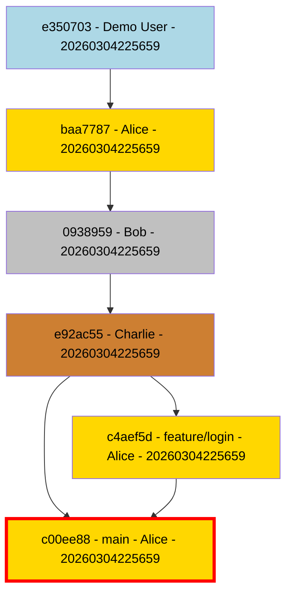
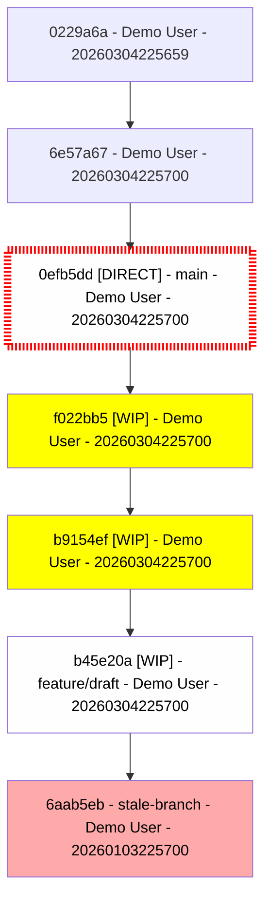
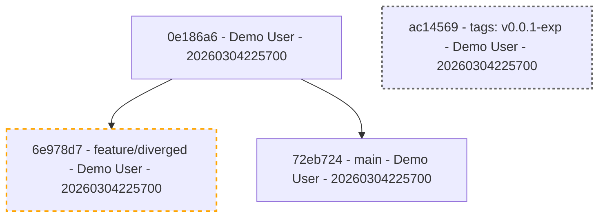

# Git Graphable Examples

This page demonstrates the visual output and hygiene analysis of `git-graphable` using generated example repositories.

## 1. Pristine Repository (Score: 100%)
Demonstrates a clean, PR-based workflow with author highlighting and critical branch marking.

**Command:**
```bash
git-graphable repo-pristine --highlight-critical --critical-branch main --highlight-authors
```

**Output:**


---

## 2. Messy Repository (Score: 76%)
Demonstrates common hygiene issues: WIP commits, direct pushes to protected branches, and stale branch tips.

**Command:**
```bash
git-graphable repo-messy --highlight-wip --highlight-direct-pushes --highlight-stale
```

**Hygiene Report:**
- **Overall Score**: 76% (C)
- **Direct Pushes**: -15% (Non-merge commits on `main`)
- **WIP Commits**: -9% (3 commits with `WIP:` in message)

**Output:**


---

## 3. Special Features (Score: 93%)
Demonstrates topological analysis features like orphan/dangling commits and divergence (behind base).

**Command:**
```bash
git-graphable repo-features --highlight-orphans --highlight-diverging-from main
```

**Output:**

