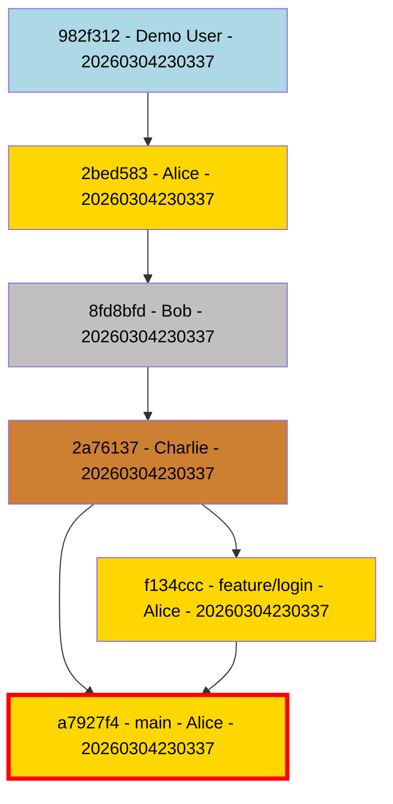
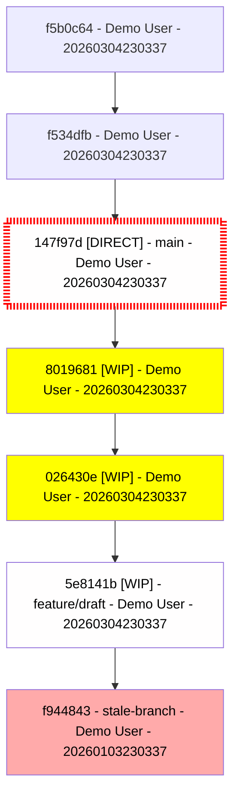
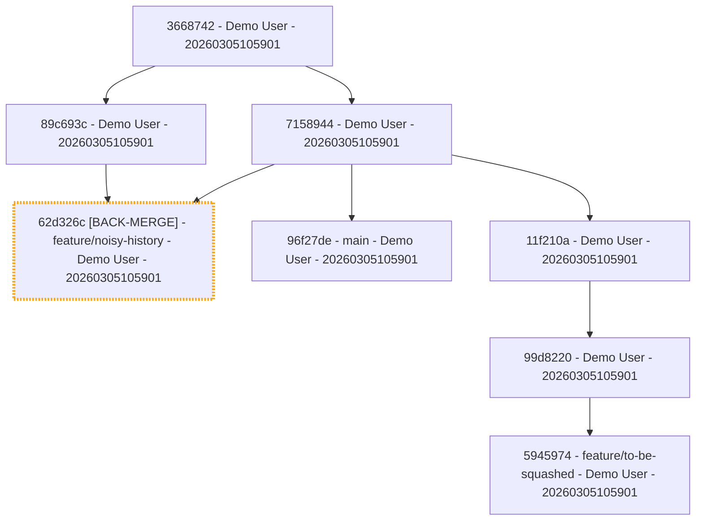
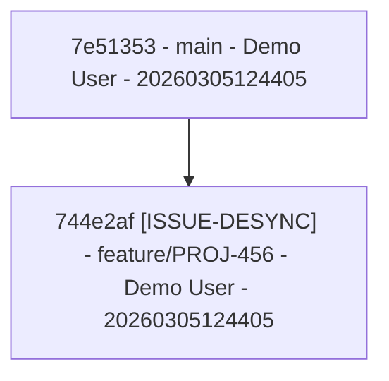
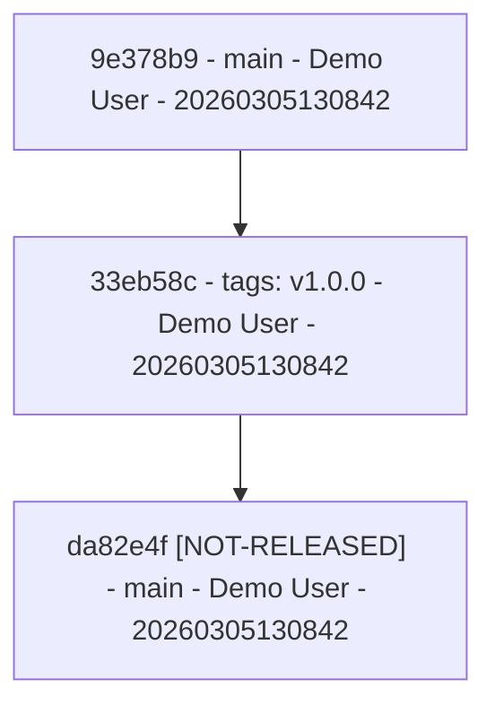
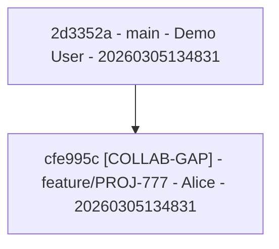

```mermaid
flowchart TD
3ea61173cf4a6c69db17b4c6501039d33a6982b0["3ea6117 - main - Demo User - 20260305105901"]
5efcb8d1f1ebb2795a738df951c5e06203f262b5["5efcb8d - Alice - 20260305105901"]
9195465c812ad54e5665012678f294b2f22d7184["9195465 - Alice - 20260305105901"]
d3a2ea8a3c8ed7409403d836f4280e7df24fe0a3["d3a2ea8 - Alice - 20260305105901"]
cd27397b8f88e090e5269311b26b77b10a61f954["cd27397 - Alice - 20260305105901"]
43458ccb4b4d435f1e726a71c36f4d74dfef3d88["43458cc - Alice - 20260305105901"]
5781a1dcd158780172ef530c7d3c4a5bbfddbb9b["5781a1d - Alice - 20260305105901"]
192391841cd43546840f9a73ca82d590a596f3d1["1923918 - Alice - 20260305105901"]
1123939f9dc7e8ac88c44560cea2854b25b8633a["1123939 - Alice - 20260305105901"]
3bb33732ee23b3c90eb56131d7c18461e635efab["3bb3373 - Alice - 20260305105901"]
92d7b93cd7f52406236dc1a771c18d3101097ac0["92d7b93 - Alice - 20260305105901"]
edc7e0989161e639f69a2e918315070a9b650257["edc7e09 - Alice - 20260305105901"]
aaa8545d80ce1c7f93f0ed635a642d52e537d418["aaa8545 - Alice - 20260305105901"]
44f32db29d6b3a917fe1f0493a78a563d164eccb["44f32db - Alice - 20260305105901"]
fcb262b2e3dce5b6d005cf5a2ee1e9d51a923053["fcb262b - Alice - 20260305105901"]
588cfa14d70f6679bb53588b4bcb8fa49adedb90["588cfa1 - Alice - 20260305105901"]
fc5736cf0a21cba3426fd0853c24f20592b2c925["fc5736c - Alice - 20260305105901"]
a4f8461065731a429ad9ae8c044827329d3083d5["a4f8461 - Alice - 20260305105901"]
543b5e4de434310b1f90817fd89ac19f735adaa8["543b5e4 - Alice - 20260305105901"]
b1fdd9163e15af3eb69105e1337bbe75813f61f7["b1fdd91 - Alice - 20260305105901"]
b1bba43af1237077c8d101b88d5a2e7aafdd3806["b1bba43 - Alice - 20260305105901"]
807f19736e0a1903dc83ec62cdf810bc5c043a1a["807f197 - Alice - 20260305105901"]
30c28e9ac75e9ca65360d6c000e3dd62b0ff48f7["30c28e9 - Alice - 20260305105901"]
f012b1d4971e5d6e9619396f9adbb32d311e0c80["f012b1d - Alice - 20260305105901"]
76310c4489cb4667e1f31e540b40b42c30b70190["76310c4 - Alice - 20260305105901"]
0007580446cab2af471bc90a29dd094175ef5617["0007580 [SILO] - feature/huge-silo - Alice - 20260305105901"]
style 0007580446cab2af471bc90a29dd094175ef5617 stroke:blue,stroke-width:6px
3ea61173cf4a6c69db17b4c6501039d33a6982b0 --> 5efcb8d1f1ebb2795a738df951c5e06203f262b5
5efcb8d1f1ebb2795a738df951c5e06203f262b5 --> 9195465c812ad54e5665012678f294b2f22d7184
9195465c812ad54e5665012678f294b2f22d7184 --> d3a2ea8a3c8ed7409403d836f4280e7df24fe0a3
d3a2ea8a3c8ed7409403d836f4280e7df24fe0a3 --> cd27397b8f88e090e5269311b26b77b10a61f954
cd27397b8f88e090e5269311b26b77b10a61f954 --> 43458ccb4b4d435f1e726a71c36f4d74dfef3d88
43458ccb4b4d435f1e726a71c36f4d74dfef3d88 --> 5781a1dcd158780172ef530c7d3c4a5bbfddbb9b
5781a1dcd158780172ef530c7d3c4a5bbfddbb9b --> 192391841cd43546840f9a73ca82d590a596f3d1
192391841cd43546840f9a73ca82d590a596f3d1 --> 1123939f9dc7e8ac88c44560cea2854b25b8633a
1123939f9dc7e8ac88c44560cea2854b25b8633a --> 3bb33732ee23b3c90eb56131d7c18461e635efab
3bb33732ee23b3c90eb56131d7c18461e635efab --> 92d7b93cd7f52406236dc1a771c18d3101097ac0
92d7b93cd7f52406236dc1a771c18d3101097ac0 --> edc7e0989161e639f69a2e918315070a9b650257
edc7e0989161e639f69a2e918315070a9b650257 --> aaa8545d80ce1c7f93f0ed635a642d52e537d418
aaa8545d80ce1c7f93f0ed635a642d52e537d418 --> 44f32db29d6b3a917fe1f0493a78a563d164eccb
44f32db29d6b3a917fe1f0493a78a563d164eccb --> fcb262b2e3dce5b6d005cf5a2ee1e9d51a923053
fcb262b2e3dce5b6d005cf5a2ee1e9d51a923053 --> 588cfa14d70f6679bb53588b4bcb8fa49adedb90
588cfa14d70f6679bb53588b4bcb8fa49adedb90 --> fc5736cf0a21cba3426fd0853c24f20592b2c925
fc5736cf0a21cba3426fd0853c24f20592b2c925 --> a4f8461065731a429ad9ae8c044827329d3083d5
a4f8461065731a429ad9ae8c044827329d3083d5 --> 543b5e4de434310b1f90817fd89ac19f735adaa8
543b5e4de434310b1f90817fd89ac19f735adaa8 --> b1fdd9163e15af3eb69105e1337bbe75813f61f7
b1fdd9163e15af3eb69105e1337bbe75813f61f7 --> b1bba43af1237077c8d101b88d5a2e7aafdd3806
b1bba43af1237077c8d101b88d5a2e7aafdd3806 --> 807f19736e0a1903dc83ec62cdf810bc5c043a1a
807f19736e0a1903dc83ec62cdf810bc5c043a1a --> 30c28e9ac75e9ca65360d6c000e3dd62b0ff48f7
30c28e9ac75e9ca65360d6c000e3dd62b0ff48f7 --> f012b1d4971e5d6e9619396f9adbb32d311e0c80
f012b1d4971e5d6e9619396f9adbb32d311e0c80 --> 76310c4489cb4667e1f31e540b40b42c30b70190
76310c4489cb4667e1f31e540b40b42c30b70190 --> 0007580446cab2af471bc90a29dd094175ef5617
```

# Git Graphable Examples

This page demonstrates the visual output and hygiene analysis of `git-graphable` using generated example repositories.

## 1. Pristine Repository (Score: 100%)
Demonstrates a clean, PR-based workflow with multi-author highlighting and critical branch marking.

**Command:**
```bash
git-graphable repo-pristine --highlight-critical --critical-branch main --highlight-authors
```

**Output:**


---

## 2. Messy Repository (Score: 76%)
Demonstrates common hygiene issues: WIP commits, direct pushes to protected branches, and stale branch tips.

**Command:**
```bash
git-graphable repo-messy --highlight-wip --highlight-direct-pushes --highlight-stale
```

**Output:**


---

## 3. Risk Analysis (Bus Factor)
Highlights branches with many commits but only one contributor. This indicates a "Review Risk."

**Command:**
```bash
git-graphable repo-risk-silo --highlight-silos --silo-threshold 20
```

**Output:**


---

## 4. Redundant History
Highlights redundant back-merges.

**Command:**
```bash
git-graphable repo-complex-hygiene --highlight-back-merges
```

**Output:**


---

## 5. Issue Status Mismatch
Highlights desyncs between Git and external trackers (Jira, GitHub Issues).

**Command:**
```bash
git-graphable repo-issue-desync --highlight-issue-inconsistencies --issue-pattern "PROJ-[0-9]+" --issue-engine script --issue-script "echo CLOSED"
```

**Output:**


---

## 6. Release Inconsistency
Highlights issues marked as "Released" in the tracker but not yet reachable from a Git tag.

**Command:**
```bash
git-graphable repo-release-desync --highlight-release-inconsistencies --issue-pattern "PROJ-[0-9]+" --issue-engine script --issue-script "echo CLOSED"
```

**Output:**


---

## 7. Collaboration Gap
Highlights when the Git commit author doesn't match the assigned issue owner in the tracker.

**Command:**
```bash
git-graphable repo-collab-gap --highlight-collaboration-gaps --issue-pattern "PROJ-[0-9]+" --issue-engine script --issue-script "echo OPEN,Bob"
```

**Output:**


---

## 8. Topological Analysis
Demonstrates features like orphan/dangling commits and divergence.

**Command:**
```bash
git-graphable repo-features --highlight-orphans --highlight-diverging-from main
```

**Output:**


---

## 9. CI Mode (Gating)
Demonstrates how to use `git-graphable` as a CI gate.

**Command (Fails):**
```bash
git-graphable repo-messy --check --min-score 80 --bare --highlight-wip --highlight-direct-pushes
```

**Output:**
```text
Error: Hygiene score 76% is below required 80%
```

---

## 10. Interactive HTML Viewer
The HTML engine produces a self-contained, interactive visualization with a live-toggle legend.

**Command:**
```bash
git-graphable repo-messy --engine html -o graph.html
```

**Key Features:**
- **Live Legend**: Toggle hygiene overlays (WIP, Direct Push, Divergence) on/off.
- **Color Modes**: Switch between Authors, PR Status, Distance, and Staleness views.
- **Searchable**: Find specific commits by hash or message.
- **Hierarchical Layout**: Powered by Dagre for a clean top-down flow.
- **Details Sidebar**: View full commit metadata upon selection.

