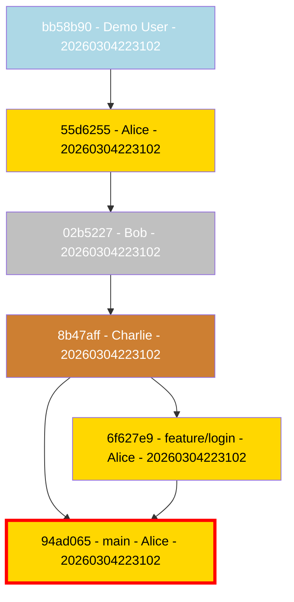
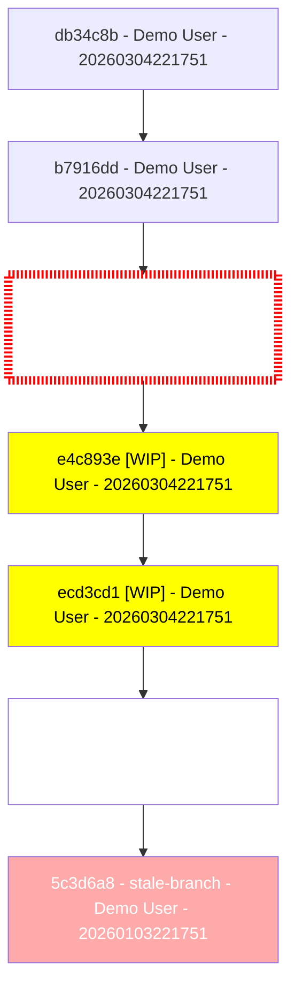

# Git Graphable Examples

This page demonstrates the visual output and hygiene analysis of `git-graphable` using generated example repositories.

## 1. Pristine Repository (Score: 100%)
Demonstrates a clean, PR-based workflow with author highlighting and critical branch marking.

**Command:**
```bash
git-graphable repo-pristine --highlight-critical --critical-branch main --highlight-authors
```

**Output:**


---

## 2. Messy Repository (Score: 76%)
...
- **WIP Commits**: -9% (3 commits with `WIP:` in message)

**Output:**


---

## 3. Special Features (Score: 93%)
...
```
