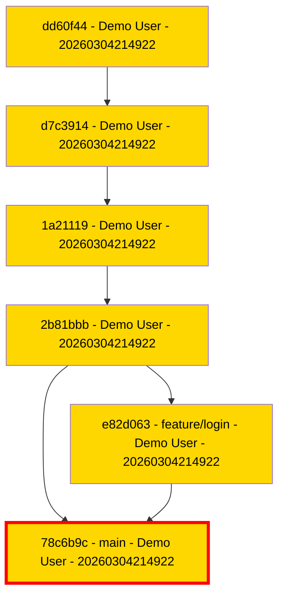
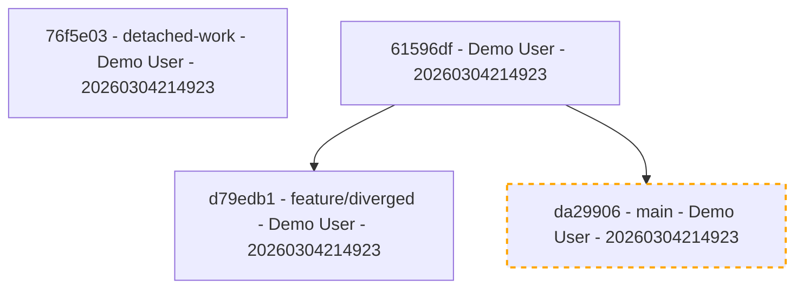

# Git Graphable Examples

This page demonstrates the visual output and hygiene analysis of `git-graphable` using generated example repositories.

## 1. Pristine Repository (Score: 100%)
Demonstrates a clean, PR-based workflow with author highlighting and critical branch marking.

**Command:**
```bash
git-graphable repo-pristine --highlight-critical --critical-branch main --highlight-authors
```

**Output:**


---

## 2. Messy Repository (Score: 76%)
Demonstrates common hygiene issues: WIP commits, direct pushes to protected branches, and stale branch tips.

**Command:**
```bash
git-graphable repo-messy --highlight-wip --highlight-direct-pushes --highlight-stale
```

**Hygiene Report:**
- **Overall Score**: 76% (C)
- **Direct Pushes**: -15% (Non-merge commits on `main`)
- **WIP Commits**: -9% (3 commits with `WIP:` in message)

**Output:**
```mermaid
flowchart TD
9233d74a1bfcd9cbbd2d3e2b91bcfd5154b978b9[9233d74 - Demo User - 20260304214922]
a14287c24abd63537ef54e7551dcfcbd5d0e0c04[a14287c - Demo User - 20260304214922]
14dffb83f2b571280d39b743f274675e2b2bfba5[14dffb8 [DIRECT] - main - Demo User - 20260304214922]
style 14dffb83f2b571280d39b743f274675e2b2bfba5 fill:#fffefe,color:white,stroke:#ff0000,stroke-width:8px,stroke-dasharray: 2 2
ddf1b786131079425a0aaeaaf8d77f3c5a6d3b6d[ddf1b78 [WIP] - Demo User - 20260304214922]
style ddf1b786131079425a0aaeaaf8d77f3c5a6d3b6d fill:#ffff00,color:black
5c369dbf4ddaeeac19935e4ea99a14713344a34f[5c369db [WIP] - Demo User - 20260304214922]
style 5c369dbf4ddaeeac19935e4ea99a14713344a34f fill:#ffff00,color:black
930cd6b92ff791c8efe1832df79a01435759137f[930cd6b [WIP] - feature/draft - Demo User - 20260304214922]
style 930cd6b92ff791c8efe1832df79a01435759137f fill:#ffff00,color:black,fill:#fffefe,color:white
6402c1594e078cd7895b10e0bcdd03ce1b8722ad[6402c15 - stale-branch - Demo User - 20260103214922]
style 6402c1594e078cd7895b10e0bcdd03ce1b8722ad fill:#ffaaaa,color:white
9233d74a1bfcd9cbbd2d3e2b91bcfd5154b978b9 --> a14287c24abd63537ef54e7551dcfcbd5d0e0c04
a14287c24abd63537ef54e7551dcfcbd5d0e0c04 --> 14dffb83f2b571280d39b743f274675e2b2bfba5
14dffb83f2b571280d39b743f274675e2b2bfba5 --> ddf1b786131079425a0aaeaaf8d77f3c5a6d3b6d
ddf1b786131079425a0aaeaaf8d77f3c5a6d3b6d --> 5c369dbf4ddaeeac19935e4ea99a14713344a34f
5c369dbf4ddaeeac19935e4ea99a14713344a34f --> 930cd6b92ff791c8efe1832df79a01435759137f
930cd6b92ff791c8efe1832df79a01435759137f --> 6402c1594e078cd7895b10e0bcdd03ce1b8722ad
```

---

## 3. Special Features (Score: 95%)
Demonstrates topological analysis features like orphan/dangling commits and divergence (behind base).

**Command:**
```bash
git-graphable repo-features --highlight-orphans --highlight-diverging-from main
```

**Output:**

